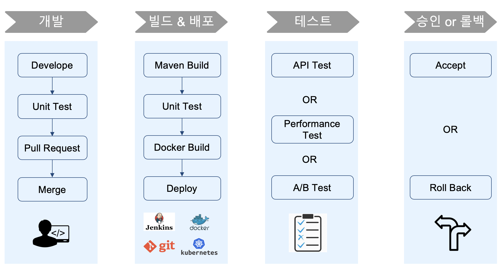
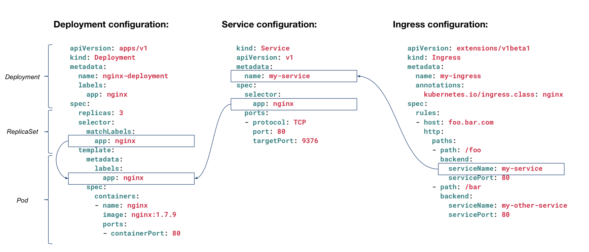
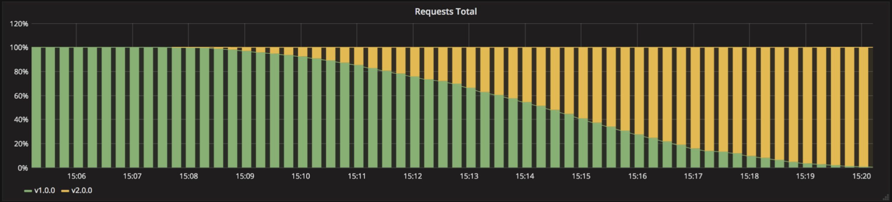
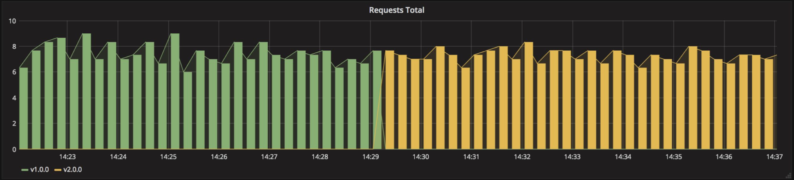
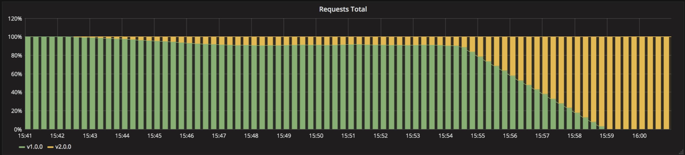

## CICD Overview

### Problems

::: warning
* Business Agility 달성을 위해 Application의 빠르고 지속적인 배포에 대한 요구 증가
* 개발과 운영 조직이 분리
* 배포로 인해 장애 발생 시 운영 조직의 책임 편중
* 배포 주기 길어짐, 배포 한번을 위해 배포 계획 수립 및 검증 작업으로 최소 몇 일 소요됨
* Application의 복잡도 증가
* 관리 대상 서비스/인스턴스 증가
:::

### Solution 
::: tip
* 운영환경과 동일한 Infrastructure/환경에서 테스트
* 빈번하고 반복적인 테스트
* Code 기반으로 Development/Staging/Production 환경에 적용
* 빠른 배포 환경
* 표준화를 통한 빌드/배포 프로세스 자동화
:::

#### Process




##  Deploy Strategies

### Deploy in Kubernetes
::: tip
* Configuration : Ingress <-> Service <-> Deployment  상호 연관 관계
* [Key]:[Value]  형태로 자유롭게 선언하여, 자원 선택시 Filter로 사용됨
:::


(ref. CFCF)


### Recreate
> Application을 중단하고, 새로운 Application을 배포함.


| Pros          | Cons                                               |
| :------------ | :------------------------------------------------- |
| Easy to setup | High impact on the user's request. downtime exists |

Example of yaml(manifest.yaml)
``` yaml
[ . . . ]
kind: Deployment
spec:
  replicas: 3
  strategy:
    type: Recreate
[ . . . ]
```
Example of command
```
kubectl apply -f ./manifest.yaml
```

### Ramped
> (aka) : incremental, rolling update
> 신규버전의 Application Instance 점진적으로 배포하고, 기존 배포된 버전의 Instance 수를 줄여 가는 배포 방식
> Kubernetes의 History관리를 통해  Rollback 쉽게 처리 할 수 있음


| Pros                                      | Cons                           |
| :---------------------------------------- | :----------------------------- |
| Easy to setup                             | Take time for rollout/rollback |
| No downtime                               | No control over traffic        |
| Keep handling ongoing rebalancing of data |                                |

Example of yaml(manifest.yaml)
``` yaml
[ . . . ]
kind: Deployment
spec:
  replicas: 3
  strategy:
    type: RollingUpdate
    rollngUpdate:
      maxSurge: 2       # how many instances(pod) to add at a time
      maxUnavailable: 0 # unavailable number of instances(pod) 
                        # can be unavailable during the rolling update
[ . . . ]
```

Example of command
```
kubectl apply -f ./manifest.yaml
```
Traffice



### Blue/Green
> (aka) : red/black
> 신규버전의 Application Instance 배포하고, 기존 Instance에 연결되는 Routing 정보를 신규 Instance로 변경.
> 서비스 변경이 완려되면 기존 Instane는 삭제처리함.

| Pros              | Cons                                                       |
| :---------------- | :--------------------------------------------------------- |
| Instant update    | Expensive, need double the resources                       |
| Good for frontend | Should proper test of the entire platform before releasing |

Example of yaml(manifest-v2.yaml)
``` yaml
[ . . . ]
kind: Service
spec:
# Match both the app and the version
# When switch traffic, update the label version with v2.0.0 for version 1.0.0
  selector:
    app: my-app
    version: v1.0.0
[ . . . ]
```

Example of command
```
kubectl apply -f ./manifest-v2.yaml
kubectl patch service my-app -p \
   '{"spec": {"selector": {"version": "v2.0.0"}}}'
kubectl delete -f manifest-v1.yaml
```

Traffic



### Canary
> Ramped 배포 방식과 유사하나, Instance 일부를 선배포하고, 검증 이후에
> 잔여 instance 모두를 배포하는 방식
> 선배포 검증에 실패할 경우 기존 Instance로 Rollback 처리함.

|Pros|Cons|
|:---|:---|
| Verison released for a subset of users| Slow |
| Convenient for error rate and performance | Sticky sesisons might be required |
| Fast rollback | need traffic control required like *istio* or *linkerd*|

|   1   |  |
| :---: | :--------------------------------: |
|   2   |  |
|   3   |  |

Traffic


### Others

* A/B Testing
  * Canary 배포와 유사하며, 필요에 따라 유입되는 요청을 각각의 버전에 배분. 사용성 테스트를 수행함
  * 유입되는 요청은 네트웍 비율 기반, http header의 조건 값 등 다양한 조건을 처리가 가능해야함
  * Application에서 조건과 테스트 결과 값을 처리해야함
* Shadow
  * 유입되는 요청에 대해, 테스트 환경으로 함께 전달되어 테스트 할 수 있는 환경
  * Shadow Instance에서 처리된 결과 값은 실제  Client에게 전달되지 않음

### Summary
* recreate if downtime is not a problem
* recreate and ramped doesn’t require any extra step (kubectl apply is enough)
* ramped and blue/green deployment are usually a good fit and easy to use
* blue/green is a good fit for front-end that load versioned assets from the same server
* blue/green and shadow can be expensive
* canary and a/b testing should be used if little confidence on the quality of the release
* canary, a/b testing and shadow might require additional cluster component

---
[[toc]]
