# Step 02. Pipeline 작성


## Get Sample Application Source
> Github 의 예제 프로젝트를 개인 Repository 로 Push함.

1. Open browser and go [github.com/cnpst/sam-zcp-lab](https://github.com/cnpst/sam-zpc-lab)
2. 예제 프로젝트 Checkout
* *Clone or download* > *Copy* click

   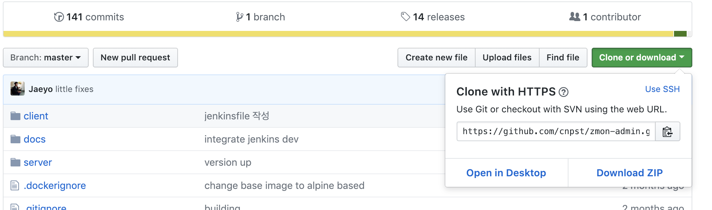

* Eclipse > Git Repository > Clone a Git repository 클릭

   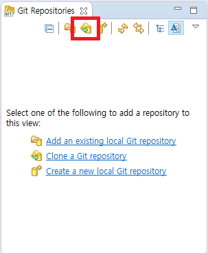

* URI 입력 후 Next > Next > Finish

   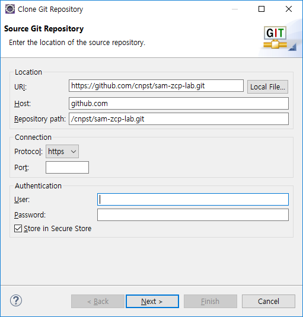

3. Git Repository 생성

* 좌측 메뉴 > DevOps > 소스 저장소

   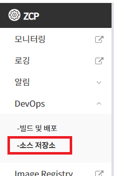

* 계정이 없는 경우 계정 생성
* 우측 내 저장소 + 버튼 클릭

   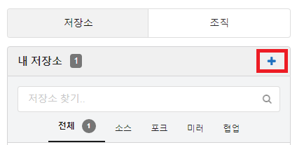

* 저장소 이름을 입력하고 저장소 만들기 버튼 클릭

   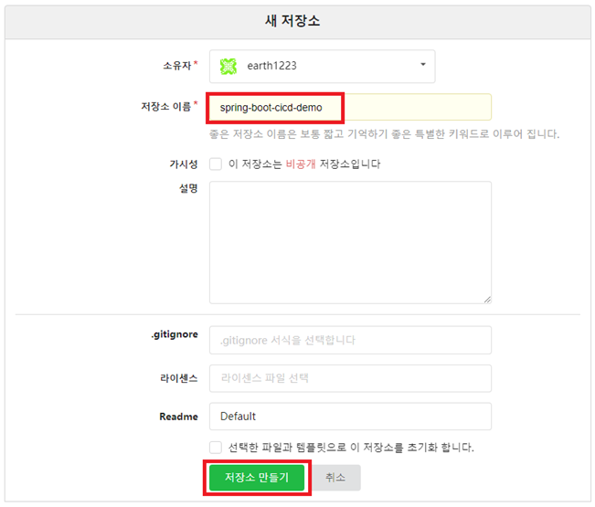

4. 예제 Project를 개인 Repository 에 PUSH

* 개인 Repository 의 Clone URL 복사

   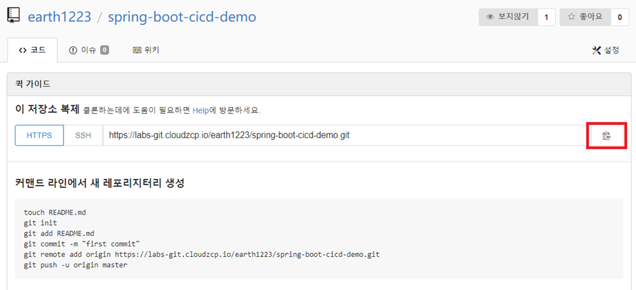

* Eclipse 에서 origin remote (Github) 삭제

   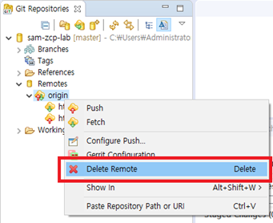

* origin remote 로 개인 Repository 등록

   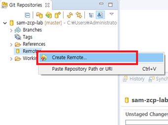

   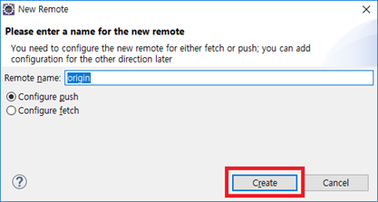

   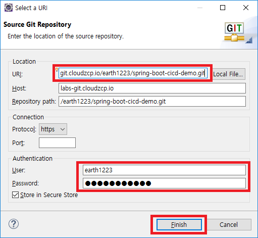

   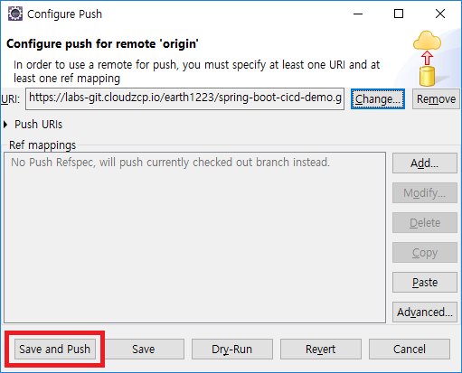

5. Import Project

* Working Tree 선택 후 팝업 메뉴에서 Import Projects 선택
   
   

* Finish 클릭

   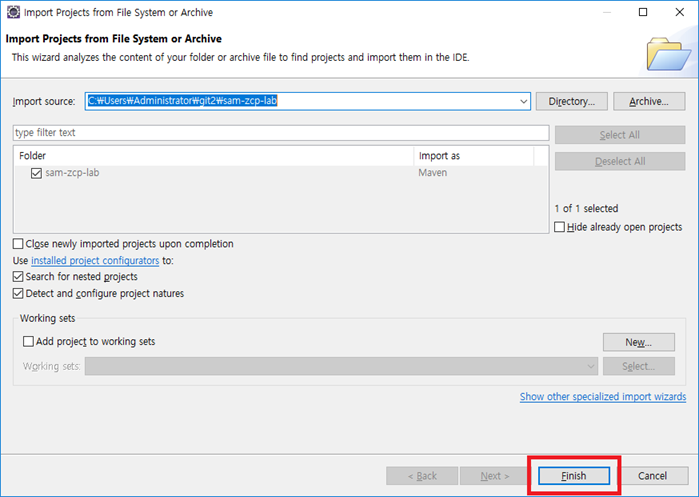

* Project Explorer 에서 확인

   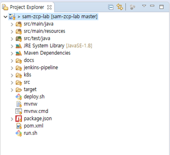

## Create Pipeline
> 사용되는 정보
* User ID : *edu01*
* Namespace : *edu01*
* Application Project Name = *spring-boot-cicd-demo*
* 사용자 Git URL : https://labs-git.cloudzcp.io/*[edu01]*/spring-boot-cicd-demo

### Development pipeline

1. edu01 폴더  Click
2. 왼쪽메뉴에서 *New Item* Click
3. Inputbox에 **spring-boot-cicd-demo-dev**(jenkins jobname) 입력
4. **Pipeline** 선택

   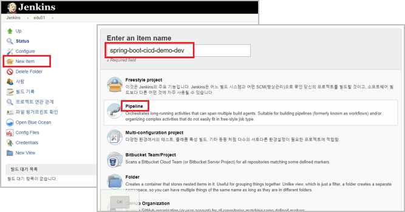

5. Pipeline에 필요한 정보 입력: Pipeline section으로 이동(Scroll down)
   * Definition 선택 : *Pipeline script from SCM*
   * SCM 선택: *Git*
   * Repositories
     * Repository URL 입력: *https://labs-git.cloudzcp.io/[edu01]/spring-boot-cicd-demo.git*
     * Credentials 선택: *edu01/...(GIT CREDENTIALS)*
   * Branch to build 입력 : **/master*
   * Repository browser 선택 : *gogs*
     * URL 입력: *https://labs-git.cloudzcp.io/[edu01]/spring-boot-cicd-demo* ( '.git' 제거, browser url )
   * Script Path 입력 : *jenkins-pipeline/deploy-pipeline* ( Git프로젝트 Root Path기준 상대 경로 )
   * 저장
   
   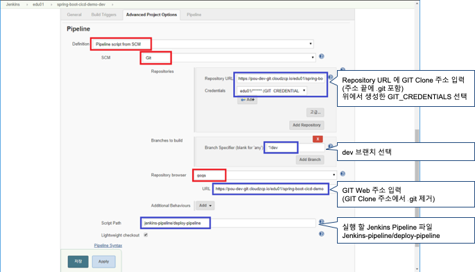
   
### Script 작성법

> jenkins-pipeline/deploy-pipeline 

> k8s/deployment.yaml

#### 구성

| Block | 내용                        |
| :---: | :------------------------ |
| 변수정의  | 내장 변수 및 Job에 필요한 기본 변수 선언 |
| 환경구성  | 내부에서 사용할 Resource에 필요한  pod 정의|
| Volume 선언| 각각의 pod에서 사용할 저장소 설정 |
| Job 선언| Git Checkout, Source Build, Docker Image build, Deploy|

#### 변수정의
> jenkins-pipeline/deploy-pipeline 파일 수정

> DOCKER_IMAGE, ZCP_USERID, K8S_NAMESPACE 변경 후 Git Remote 로 Push
* label: 내부에서 사용하는 UUID
* DOCKER_IMAGE: Pipeline에서 사용할 이름. [Registry URL]/[Repository Name]/[Image Name]. Tag명은 생략하고 정의 함.
  Tag는 변수로 입력 받거나, 자동할당됨
* ZCP_USERID : 배포 시 사용 할 ZCP 사용자 계정.
* K8S_NAMESPACE: 배포영역의 Namespace 이름
* VERSION: 개발 단계는 develop으로 고정처리함.

  
```groovy
// Jenkins Shared Library 적용
@Library(‘retort-lib’) _
// Jenkins slave pod에 uuid 생성
def label = “Jenkins-${UUID.randomUUID().toString()}”
def ZCP_USERID = 'edu01'
def DOCKER_IMAGE = 'edu01/spring-boot-cicd-demo' // Harbor Project Name : edu01
def K8S_NAMESPACE = 'edu01'
def VERSION = 'develop'

// Pod template 시작
podTemplate(label:label,
    // Kubernetes cluste에 배포하기 위한 secret
    serviceAccount: “zcp-system-sa-${ZCP_USERID}”,
    ...){
        ......
    }
}
```
#### 환경구성 
1. k8s/deployment.yaml 파일 수정

> 배포 할 Docker image 주소 변경 후 Git Remote 로 Push

```yaml
...
      containers:
      - name: spring-boot-cicd-demo
        image: labs-registry.cloudzcp.io/edu01/spring-boot-cicd-demo:develop
        ports:
        - containerPort: 8080
          name: tomcat
...
```
2. k8s/ingress.yaml 작성
> 외부에 서비스 노출에 필요한 Domain 정보 설정
> 사용자 ID 기준으로 host 정보 변경
> (테스트용) host 파일에 IP(169.56.106.158) 등록

```yaml
apiVersion: extensions/v1beta1
kind: Ingress
metadata:
  name: spring-boot-cicd-demo
spec:
  rules:
  - host: [edu01.cloudzcp.io]
    http:
      paths:
      - path: /
        backend:
          serviceName: spring-boot-cicd-demo
          servicePort: 80

```

#### Volume 선언 (기본값 사용)
(생략)

#### Job 선언
> Job의 순서가 중요함

1. Git checkout
2. Source Build(Maven): Public Maven Repository 접근이 안되는 경우, Jenkins에 Provate Nexus 서버 설정 필요함.
3. Docker Image Build: ZCP 용 Private Registry 주소를 위한  ${HARBOR_REGISTRY}는 내장된 변수로서, Public Docker Hub를 사용할 경우 생략 또는 Registry 주소를 명시적으로 지정해야함 
`dockerCmd.build tag: ${HARBOR_REGISTRY}/${DOCKER_IMAGE}:${VERSION}"`
4. Deploy: 필요한 kubectl 명령어를 반복해서 적용
`kubeCmd.apply file: 'k8s/service.yaml', namespace: K8S_NAMESPACE`

Script Source
```groovy
// Jenkins Shared Library 적용
@Library(‘retort-lib’) _
// Jenkins slave pod에 uid 생성
def label = “Jenkins-${UUID.randomUUID().toString()}”
// Kubernetes cluste에 배포하기 위한 사용자 계정
def ZCP_USERID = ‘edu01’
// Docker image 명
def DOCKER_IMAGE = ‘edu01/spring-boot-cicd-demo‘
// 배포 할 Kubernetes namespace
def K8S_NAMESPACE = ‘edu01‘
// Docker Image 의 Tag
def VERSION = ‘develop’

// Pod template 시작
podTemplate(label:label,

    // Kubernetes cluste에 배포하기 위한 secret
    serviceAccount: “zcp-system-sa-${ZCP_USERID}”,

    // 빌드를 실행 할 Jenkins slave pod 환경 구성    
    containers: [        
        containerTemplate(name: ‘maven’, image: ‘maven:3.5.2-jdk-8-alpine’, ttyEnabled: true, command: ‘cat’),       containerTemplate(name: ‘docker’, image: ‘docker’, ttyEnabled: true, command: ‘cat’),        containerTemplate(name: ‘kubectl’, image: ‘lachlanevenson/k8s-kubectl’, ttyEnabled: true, command: ‘cat’)
    ],

    // Pod에 연결할 Volume 설정    
    volumes: [        
        hostPathVolume(hostPath: ‘/var/run/docker.sock’, mountPath: ‘/var/run/docker.sock’),        persistentVolumeClaim(mountPath: '/root/.m2', claimName: ‘zcp-Jenkins-mvn-repo’)    
    ]) {
    node(label) {
        // 소스 코드 Checkout Stage
        stage('SOURCE CHECKOUT') {
            // 소스 코드 Checkout
            // 소스 코드 Repository 의 접속 정보는 Jenkins Pipeline 설정할 때 지정한 정보를 사용함
            def repo = checkout scm
        }
 
        // Maven Build Stage
        stage('BUILD MAVEN') {
            // maven container 동작 수행
            container('maven') {
                // mvn 빌드 수행
                // maven goal은 clean package
                // Local Repository 는 container 내부의 /root/.m2/${JOB_NAME} 을 사용.
                mavenBuild goal: 'clean package', systemProperties:['maven.repo.local':"/root/.m2/${JOB_NAME}"]
            }
        // Docker Build & Push Stage
        stage('BUILD DOCKER IMAGE') {
            // Docker container 에서 동작 수행
            container('docker') {
                // docker build 실행
                // Dockerfile 명, 위치를 별도로 지정하지 않는 경우 소스 코드 root 의 Dockerfile 을 이용해 빌드
                dockerCmd.build tag: ＂${HARBOR_REGISTRY}/${DOCKER_IMAGE}:${VERSION}“
                // Image Registry 에 Docker image push
                dockerCmd.push registry: HARBOR_REGISTRY, imageName: DOCKER_IMAGE, imageVersion: VERSION, credentialsId: ‘HARBOR_CREDENTIALS’
            }
        }
        // Kubernetes 배포 Stage        
        stage('DEPLOY') {
            // kubectl container 에서 동작 수행            
            container('kubectl') {
                // service 생성 또는 업데이트
                kubeCmd.apply file: 'k8s/service.yaml', namespace: K8S_NAMESPACE
                // ingress 생성 또는 업데이트
                kubeCmd.apply file: ‘k8s/ingress.yaml’, namespace: K8S_NAMESPACE
                // deployment 생성 또는 업데이트
                kubeCmd.apply file: ＇k8s/deployment.yaml＇, namespace: K8S_NAMESPACE, wait: 300            
            }
        }    
    }
}
```

### 배포실행 및 확인

1. 실행 : Job Menu > *Build Now* Click
   
   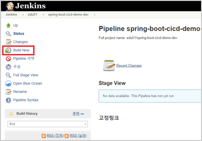

2. 확인 : 콘솔출력

   

---
[[toc]]
