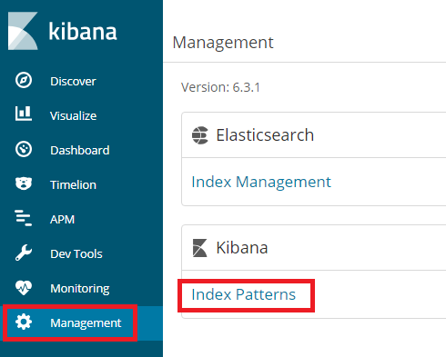
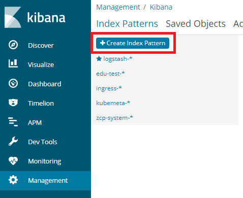
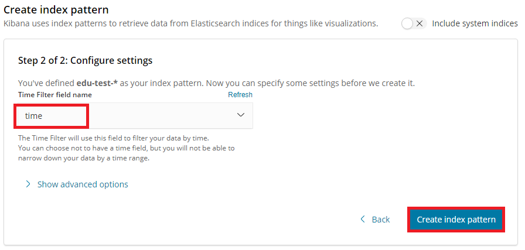
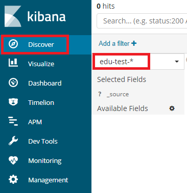
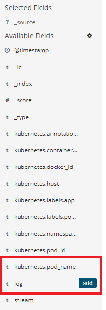
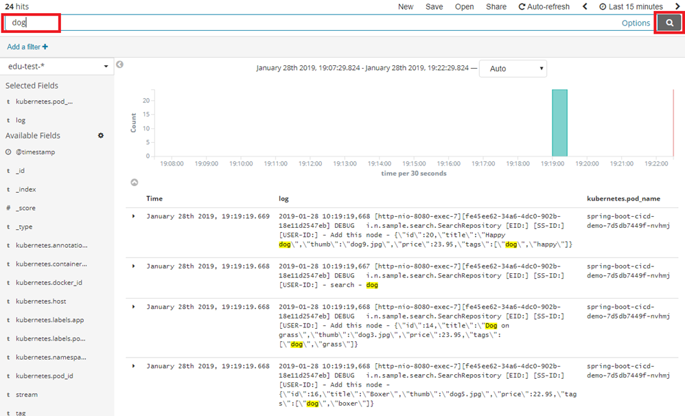

# Step 01. Logging

## Index Pattern 생성

1. Left menu > Logging 클릭

   

2. Management > Index Patterns 클릭

   

3. Create Index Pattern 

   

4. Index Pattern 명 입력 > Next Step
* Namespace 명 + "-*" 입력
* 아래 Index 목록에 금일 Index 가 선택되는지 확인

   

5. Time Filter 에 time 선택 > Create index pattern 클릭

   

## Log 검색

1. Left menu > Discover 클릭 > Index pattern 선택

   

2. 상세 필드 선택
* log, kubernetes.pod_name add

   

3. keyword 검색
* 검색 창에 keyword 입력 후 검색 버튼 클릭

   

---
[[toc]]