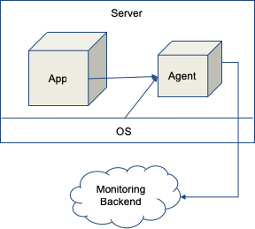
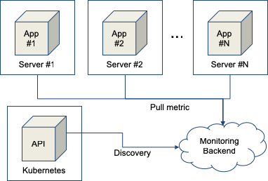

# Monitoring
::: tip
* Production 환경에서 Kubernetes 사용 비율 증가 => 컨테이너 기반 운영 환경 증가
* Container 환경에서 모니터링이 새로운 도전 과제로 급부상
* 클라우드 환경에서 동적으로 생성되고 소멸되는 자원들의 모니터링의 어려움
:::

## On-Premise
> * 고사양의 서버에 Application을 크게 운영
> * Monitoring Agent를 서버에 설치
> * Agent가 App 및 OS의 metric 수집해 Backend에 전송

## Cloud Native
> * Application을 작게 운영하고 필요할 때 마다 확장
> * 동적으로 확장하는 서버에 Agent 설치 불가능
> * Kubernetes API를 통해 동적으로 확장된 서버 endpoint를 discovery
> * Monitoring Backend에서 discovery한 endpoint를 통해 metric 수집

## Prometheus
> * Service Discovery, Metric 수집 및 저장 기능을 통합해 제공하는 Monitoring 시스템
> * CNCF의 메인 프로젝트로 Container 기반 Monitoring 시스템의 defactor
> * Kubernetes외의 다른 Cloud Provider에 대한 Service Discovery 기능 제공으로 동적인 Cloud를 효율적으로 모니터링
> * 다양한 exporter(수집기)를 제공해 외부 시스템 통합 모니터링 가능
> * 자체 TSDB(Time Series Database) 보유. Metric data 저장 및 관리에 최적화
> * 자체 Alert 엔진 보유. 외부 시스템과 연계하여 Alarm을 송신 가능
> * Web UI와 Grafana를 통해 Data 시각화

---
[[toc]]